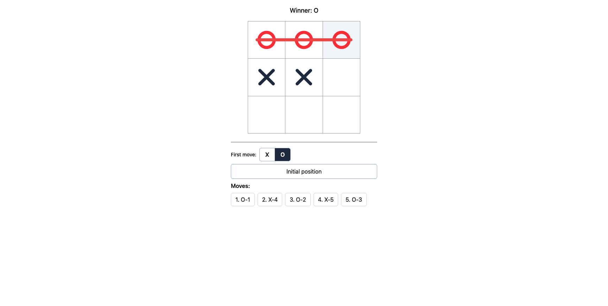

# Tic-Tac-Toe

A small, polished Tic-Tac-Toe game built with React 19, TypeScript, Tailwind CSS v4, and Vite.



## Features

- **Classic 3×3 gameplay** — two players alternate placing `X` and `O`.
- **Choose who goes first** — toggle between `X` and `O` for the opening move.
- **Winning line highlight** — the winning three-in-a-row is drawn across the board.
- **Draw detection** — recognizes a full board with no winner.
- **Move history & time travel** — jump back to any previous position.
- **Reset** — return to the initial position at any time.

## Tech Stack

- [React 19](https://react.dev/) (with the React Compiler)
- [TypeScript](https://www.typescriptlang.org/)
- [Tailwind CSS v4](https://tailwindcss.com/)
- [Vite](https://vite.dev/)
- [pnpm](https://pnpm.io/) for package management

## Getting Started

Requires Node.js `24` (see [.nvmrc](.nvmrc)) and pnpm.

```bash
# install dependencies
pnpm install

# start the dev server (http://localhost:5173)
pnpm dev
```

## Scripts

| Command        | Description                         |
| -------------- | ----------------------------------- |
| `pnpm dev`     | Start the Vite dev server           |
| `pnpm build`   | Type-check and build for production |
| `pnpm preview` | Preview the production build        |
| `pnpm lint`    | Run ESLint                          |

## Project Structure

```
src/
├── app.tsx                  # App shell
├── main.tsx                 # Entry point
├── types.ts                 # Shared types (SquareType, Winner)
├── components/
│   ├── game.tsx             # Game state, status, history & controls
│   ├── board.tsx            # 3×3 grid layout
│   ├── square.tsx           # Single clickable cell
│   ├── mark.tsx             # X / O glyph rendering
│   └── winning-line.tsx     # Winning-line overlay
└── utils/
    ├── game.ts              # calculateWinner & isDraw logic
    └── class-names.ts       # cn() Tailwind class helper
```

## How It Works

Game state lives in [game.tsx](src/components/game.tsx) as a flat array of nine squares.
On each move the player is derived from the move index and the chosen first player, the
board is updated immutably, and [calculateWinner](src/utils/game.ts) checks the eight
possible winning lines. The full move history is kept so you can jump back to any earlier
position.
